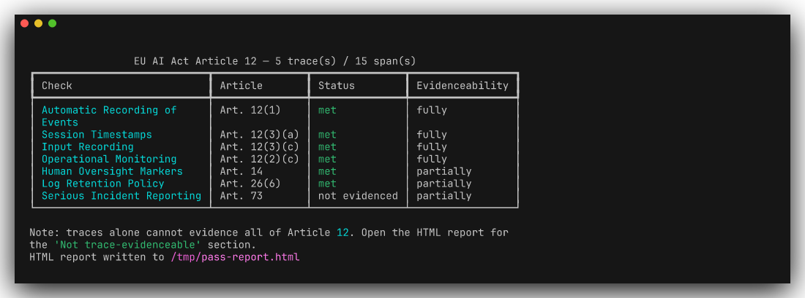
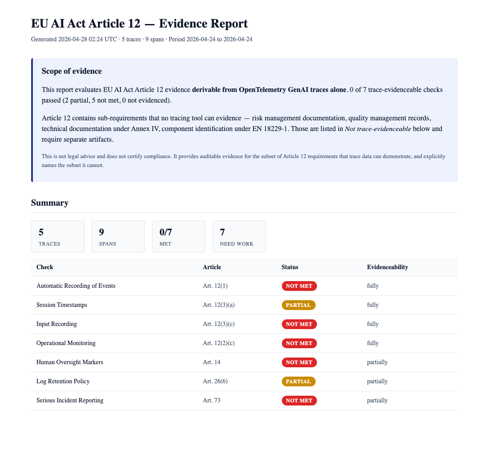

# AgentAudit

> **OpenTelemetry GenAI traces → EU AI Act Article 12 evidence reports.**
> We tell you what your traces prove, and what they don't.

## What this is

A single-purpose CLI: point it at OpenTelemetry traces from your AI agent, get an HTML evidence report mapped to EU AI Act Article 12.

Deliberately narrow:

- **One framework**: EU AI Act Article 12 (seven trace-evidenceable checks)
- **One input**: OpenTelemetry GenAI semantic conventions (JSONL)
- **One output**: a single self-contained HTML file





## Quick start

```bash
pip install ai-agent-audit

agentaudit report your-traces.jsonl \
  --retention-days 365 \
  --out report.html
open report.html
```

Already have OTel traces from your own agent (Langfuse, Laminar, OpenLLMetry, plain OTLP exporter)? Point `agentaudit report` at your JSONL.

### From source

```bash
git clone https://github.com/lightshadow1/agent-audit.git
cd agent-audit
uv sync --extra dev
uv run agentaudit report tests/fixtures/otel_pass.jsonl \
  --retention-days 365 \
  --out report.html
```

## What gets checked

Seven trace-evidenceable Article 12 requirements:

| Check | Article | Evidenceability |
|---|---|---|
| Automatic recording of events | 12(1) | fully |
| Session timestamps | 12(3)(a) | fully |
| Input recording | 12(3)(c) | fully |
| Operational monitoring | 12(2)(c) | fully |
| Human oversight markers | 14 | partially |
| Log retention policy | 26(6) | partially |
| Serious incident reporting | 73 | partially |

`fully` = trace data alone can prove this.
`partially` = traces give part of the picture; declared config or surrounding context is needed for the rest.

## What this is *not*

**Not a compliance score.** Article 12 contains sub-requirements that no tracing tool can evidence — risk management documentation, quality management records, technical documentation under Annex IV, component identification under EN 18229-1. The HTML report names those sub-requirements explicitly and points at the artifacts you'd need to evidence them.

**Not legal advice. Not a certification.** It is auditable evidence for the subset of Article 12 that trace data can demonstrate, with explicit honesty about the subset it cannot.

## Three example fixtures

The repo ships three OpenTelemetry trace files that exercise the spectrum of outcomes:

| Fixture | Origin | What it shows |
|---|---|---|
| `tests/fixtures/otel_pass.jsonl` | `examples/toy_agent.py` | Well-instrumented agent — every trace-evidenceable check is met |
| `tests/fixtures/otel_under_instrumented.jsonl` | `examples/under_instrumented_agent.py` | Real agent missing oversight + token tracking — realistic gap pattern |
| `tests/fixtures/otel_fail.jsonl` | `examples/mutate_fixture.py` | Synthetically broken trace data — decisive failures across most checks |

Run any of them through `agentaudit report` to see how the same logic surfaces different gap shapes.

## CLI

```
agentaudit report <input.jsonl> [options]

Options:
  --source otel              Trace source (only otel in v1)
  --retention-days N         Declared log retention; Article 26(6) requires ≥180
  --out PATH                 HTML report output (default: report.html, '' to skip)
  --json PATH                Optional JSON dump of the full Report object
  --quiet, -q                Suppress the terminal table

Exit codes:
  0  every check is met or not_evidenced
  1  at least one check is not_met (CI gating)
  2  bad input or unsupported source
```

## How it works

1. **Adapt** — Read OTLP-JSON (`gen_ai.*` semantic conventions) into a normalized `Span` model
2. **Assess** — Seven Article 12 checks each return `met` / `partial` / `not_met` / `not_evidenced` plus evidence and remediation text
3. **Report** — Render HTML with status badges, per-check evidence cards, and a prominent "Not trace-evidenceable" section

## What traces *cannot* evidence

Listed in every report:

- **Art. 12(2)(a)** — Risk Management System Records
- **Art. 12(2)(b)** — Post-Market Monitoring
- **Art. 12(3)(b)** — Identification of Natural Persons for Verification
- **EN 18229-1** — Component Identification
- **Art. 11 / Annex IV** — Technical Documentation
- **Art. 17** — Quality Management System

Each entry names the artifact you'd need.

## Roadmap

v1 covers Article 12 only. Possible v2+ work, gated on real user signal:

- SOC 2 Common Criteria mappings (same evidence, different labels)
- NIST AI RMF
- Multi-agent harness architecture assessment (planner / generator / evaluator)
- Langfuse REST adapter
- PDF export

## Reference

- [EU AI Act Article 12 full text](https://artificialintelligenceact.eu/article/12/)
- [OpenTelemetry GenAI semantic conventions](https://opentelemetry.io/docs/specs/semconv/gen-ai/)

## License

Apache 2.0 — see [LICENSE](LICENSE).
